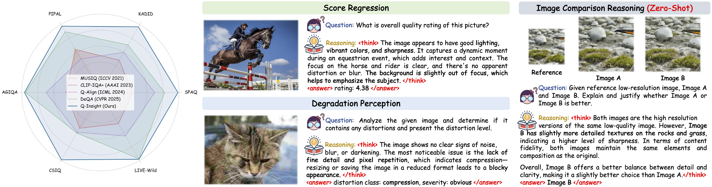

<div align="center">
<h3>

Q-Insight: Understanding Image Quality via Visual Reinforcement Learning
</h3>


[Weiqi Li](https://scholar.google.com/citations?user=SIkQdEsAAAAJ), [Xuanyu Zhang](https://scholar.google.com/citations?user=Sq2q-E8AAAAJ&hl=en), Shijie Zhao, Yabin Zhang, Junlin Li, Li Zhang and [Jian Zhang](https://jianzhang.tech/)

*School of Electronic and Computer Engineering, Peking University*

*ByteDance Inc.*
</div>

## 🔥 Introduction

<p align="center">
  
</p>

## ✏️ To Do List
- [ ] Release inference code and weights
- [ ] Release training code
- [x] Release the paper

## Citation
```

```
